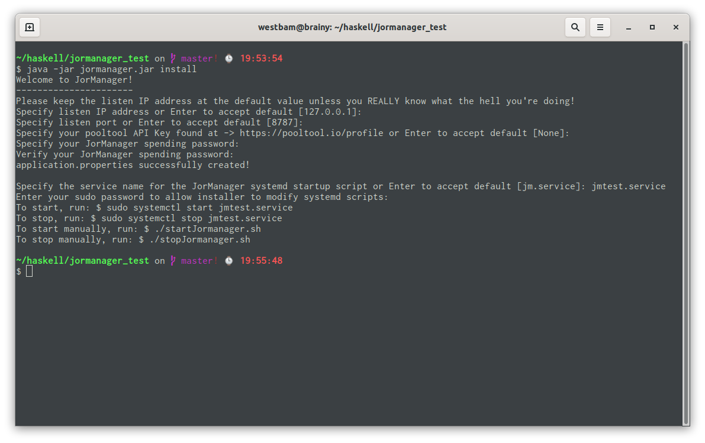
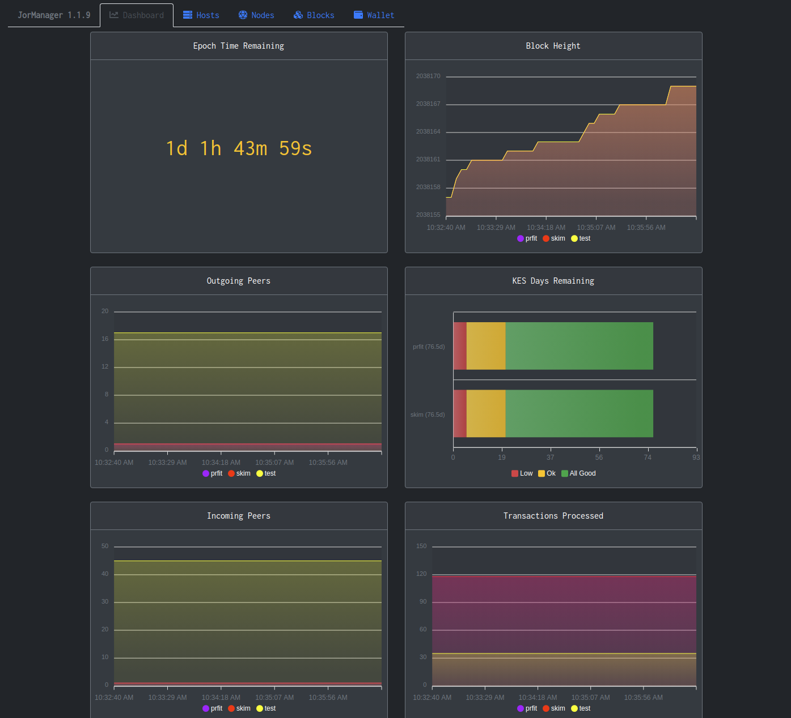

# JorManager

JorManager is a GUI-based Cardano stakepool management system. 

## Requirements
 * Java 14 or higher
 
## Prereqs

On any remote server, you'll need to have `cardano-cli` and `cardano-node` installed.

On the remote server, you need to edit `/etc/ssh/sshd_config`. Edit this line to add `CARDANO_NODE_SOCKET_PATH`. Then restart sshd service.

```
# Allow client to pass locale environment variables
AcceptEnv LANG LC_* CARDANO_NODE_SOCKET_PATH
```
This is a work-around until my enhancement request goes through that allows me to set the socket path on the cmd-line instead of through a stupid environment variable. SSH has restrictions on environment variables by default.

Upvote here -> https://github.com/input-output-hk/cardano-node/issues/1388

Install `cardano-cli` and `cardano-node` on any remote relays or core nodes. Configure key-based SSH to the servers. Ideally, use ed25519 keys.

https://medium.com/risan/upgrade-your-ssh-key-to-ed25519-c6e8d60d3c54

## Security

Protecting the security of your stakepool system is your responsibility as an operator. While JorManager will perform some security measures like encrypting secret keys in the database, things like network security, firewalls, etc are still important. Don't get lax thinking that JorManager will do everything for you. It won't.

## Installation

1. Download jormanager to a folder of your choosing. For example `/home/<username>/haskell/jormanager/`. Rename the file to `jormanager.jar`
2. Run the jar file installer program. 
3. **SAVE YOUR SPENDING PASSWORD in a secure location!!!** If you lose this password, you lose any secret keys stored in JorManager. You're done, kaput, mount your picture on the stakepool operator wall of shame.

```
$ java -jar jormanager.jar install
```

    
    
## Running

The installer has created several ways for you to run JorManager. If systemd was found on your system, the installer has created systemd scripts for you.
```
$ sudo systemctl start jm.service
$ sudo systemctl stop jm.service
```

If you don't have or use systemd, manual startup/shutdown scripts have been created for you.
```
$ ./startJormanager.sh
$ ./stopJormanager.sh
```

To access JorManager, open a browser to
```
http://localhost:<install_port>
```


If something gets screwed up, you might be instructed to dig into the database. It can be accessed at
```
http://localhost:<install_port>/h2-console
```

## Get Started

The first thing you'll want to do to get started is to create a local host under the `Hosts` tab.

Second, create a node on the local host under the `Nodes` tab. Set this node as the default node. It will be used for sending transactions and any key generation you need to perform.

Third, you'll want to create a payment address and send some money to it. I like to keep a small fund just for paying fees out of.

Once you've completed that exercise, why not spin up a remote relay on a remote host. 

Later, create an owner staking account in the wallet. Send some pledge funds to it. Use it to create a core stakepool node.

JorManager doesn't *YET* manage topology files for you. If one doesn't exist when you create your node, a default one will be created for you. You'll probably want to customize this manually.

## Support

If you need support, the Beta test group meets on this telegram channel -> https://t.me/jormanager

#### Project Support

This project is designed to do nothing more than help out the Cardano community and ecosystem. It's offered without charge and **without warranty** of any kind. However, if you feel inclined to tip the developer, that can be done by sending MainNet ADA to the following address:
  
```
addr1q8044ycsxth7gdfcp3uqus3r7y33agkqxy0gygq2xlarp08l27sthj42mfetdc7kmyzycssdr2xajau53pxnjqslr63sntagm2
```

###### Release Notes
1.0.5-SNAPSHOT

 * Improve KES dashboard chart
 
1.0.4-SNAPSHOT

 * Updates to block log
 * Allow editing of node colors
 
1.0.3-SNAPSHOT

 * Enhancements to block logging and display
 * Dashboard time in epoch remaining
 
1.0.2-SNAPSHOT

 * Add pledge type to wallet entry types
 
1.0.1-SNAPSHOT

 * Fixing bugs
 
1.0.0-SNAPSHOT

 * First release
 
1.0.0_RC_1-SNAPSHOT

 * Minimum viable product. Expect a few bugs still.
 
1.0.0_OG_4-SNAPSHOT

 * Fixes to Windows wallet-only mode
 * Fix to reading wallet entries because UTXO format changed to add quotes.
 
1.0.0_OG_3-SNAPSHOT
 
 * Apply Apache 2.0 license since this is a derivative work of cardano-cli and cardano-node which is licensed under Apache 2.0
 * Working Wallet and transactions
 * Wallet Backup support
 * Support for mainnet_candidate releases
 
1.0.0_OG_2-SNAPSHOT

 * Some basic wallet functionality 
 
1.0.0_OG_1-SNAPSHOT

 * The First OG pre-release for the haskell node. 
 
0.3.7-SNAPSHOT

 * Allow two attempts to demote a leader
 
0.3.6-SNAPSHOT

 * Tweaks to bootstrap
 * Don't shutdown node due to leader log mismatch until second attempt.
 
0.3.5-SNAPSHOT

 * Add Pool dropdown to block log
 * Validate upcoming slot counts each leader election cycle
 
0.3.4-SNAPSHOT

 * Send leader block counts to AdaStat.net
 
0.3.3-SNAPSHOT

 * Update default keystorage path
 * Change standby leader UI

0.3.2-SNAPSHOT

 * Uncap number of pools you can run
 
0.3.1-SNAPSHOT

 * Use old method for peer counts since peerConnectedCnt is outgoing-only.
 
0.3.0-SNAPSHOT

 * Configure multiple pools on one JorManager cluster
 
0.2.12-SNAPSHOT

 * Ensure there is still a leader even if we are behind pooltool majorityMax
 
0.2.11-SNAPSHOT

 * Update installer for Jormungandr 0.8.17 preferred_list peers
 
0.2.10-SNAPSHOT

 * Use peerConnectedCnt from node stats if available instead of ss command
 
0.2.9-SNAPSHOT

 * Fix pooltool slots send to once per epoch 
 
0.2.8-SNAPSHOT
 
 * Fix bug related to sending slots to pooltool multiple times
 
0.2.8-SNAPSHOT

 * Add reporting of encrypted block logs to pooltool
 
 * Add renice support for increasing a process's priority during block minting
 
0.2.7-SNAPSHOT

 * Fix bug with blocks showing as sniped in blocks history page when they aren't validated yet.
 
0.2.6-SNAPSHOT

 * Improve epoch cutover checks to ensure nodes got leader logs
 
0.2.5-SNAPSHOT

 * Add blocks history page at http://localhost:8080/blocks/index.html
 
0.2.4-SNAPSHOT
 
 * Fix viewport of status website so it looks ok on mobile
 
 * Add Last Updated field on status website
 
0.2.3-SNAPSHOT
  
 * Updates to websockets for CORS
  
 * Add processId in blocks.json
  
 * Adjust some defaults for 0.8.12+
  
0.2.2-SNAPSHOT

 * Fix `jormanager.max_bootstrap` not being respected.

 * Fixes for JWT authentication
 
 * Added status page at http://localhost:8080/status/index.html
 
0.2.1-SNAPSHOT

 * Fix for node probation not displaying correctly in log
 
 * Add logging to shutdown so we can be confident jormungandr instances have shut down
 
 * Add JWT authentication
  
 * Add /status REST endpoint (authenticated)
 
 * Add /jormanager-websocket endpoint with /topic/status subscription. (authenticated) 
 
0.2.0-SNAPSHOT

 * Allow any duration properties to be specified as ##d ##h ##m ##s or ##ms 
 
 * Add leadership probation period for nodes falling behind on a leadership election cycle
 
 * Allow zero-prefixed ids for incrementing. 
 
 * Allow unquoted ids when pinging trusted_peers
 
0.1.16-SNAPSHOT

 * Add additional logging & bug fixes

0.1.15-SNAPSHOT
 
 * Validate leadership every leader election cycle. Validate leadership with every promote/demote.
 
 * Fix for nodeCount changing by more than increments of 1
 
 * Add `jormanager.node_stagger_by_bootstrap` requiring JorManager to wait for previous node to bootstrap before starting next.
 
0.1.14-SNAPSHOT

 * Remove nodeId from status output json for security reasons
 
 * Cleaner error message when there is a pooltool error
 
0.1.13-SNAPSHOT

 * Config option for Windows user so kill.exe can work
 
 * Additional bug fixes for epoch cutover and nasty ConcurrentModificationException
 
0.1.12-SNAPSHOT

 * Do an extra sanity-check before block minting to ensure only one node is a leader
 
0.1.11-SNAPSHOT
 
 * Make an error demoting node after epoch cutover a fatal error to prevent adversarial forks
 
0.1.10-SNAPSHOT

 * Add `jormanager.pooltool.delay_ms` configuration option
 
 * Add `jormanager.standby.mode` to run JorManager with no leader elected until this setting is changed. default: false
 
0.1.9-SNAPSHOT

 * Fix issue with demote leader at epoch cutover timing out
 
 * Add option to export a peers.yaml list for sharing with others or yourself.
 
0.1.8.1-SNAPSHOT

 * Fix deadlock changing jormanager.nodestats_timeout_ms
 
0.1.8-SNAPSHOT

 * Prevent nodes with rapid changes in peers from becoming leader
 
0.1.7-SNAPSHOT

 * Support higher java versions
 
0.1.6-SNAPSHOT

 * add application.properties value jormanager.node_sequential_api_failures_allowed 
 
0.1.5-SNAPSHOT

 * add application.properties value jormanager.increment.public_id.enabled
 
0.1.4-SNAPSHOT

 * Add pooltool additional params
 
 * Allow editing of some application.properties values at runtime
               
0.1.3-SNAPSHOT

 * Fix release for ss on some platforms not supporting the `-O --oneline` option.

0.1.2-SNAPSHOT

 * Use ss for peers counts, bug fixes 

0.1.1-SNAPSHOT

 * Passive node support

0.1.0-SNAPSHOT

 * Web security stub, ping peers before bootstrap, simultaneous firewall update fix

0.0.9-SNAPSHOT

 * Add systemd and rsyslog config scripts.

0.0.8-SNAPSHOT

 * Include pooltool max when calculating fallen-behind nodes

0.0.7-SNAPSHOT

 * UFW firewall support.

0.0.6-SNAPSHOT

 * Handle Epoch cutover.

0.0.5-SNAPSHOT

 * Shut down bootstrapping nodes 5 seconds before block creation times.

0.0.4-SNAPSHOT

 * Add quiet period for leader election during block creation times.

0.0.3-SNAPSHOT

 * Bug fixes & cleaned up logging

0.0.2-SNAPSHOT

 * Bug fixes 

0.0.1-SNAPSHOT

 * Initial Beta Release