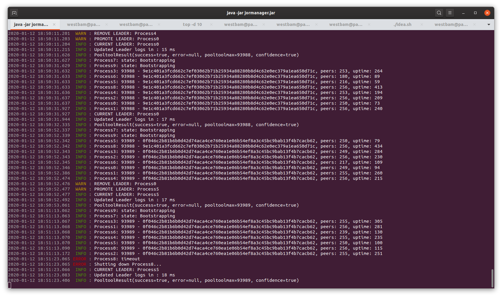
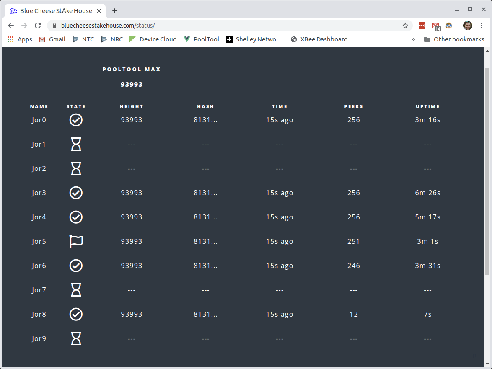

# JorManager

This project was born out of my frustration as a stakepool operator on the incentivized testnet for cardano. It is designed to spin up many Jormungandr nodes at once for improved reliability and bootstrapping. The nodes are monitored for healthiness on an interval and a single node in the cluster is promoted to leader (capable of minting blocks). Other nodes remain passive, but could be promoted to leader if they become the healthiest.





## Health

The health calculation is determined by:

  * The block height of a node. Higher is better.
  * The number of peers a node has.

## Scripted Setup

Ola Ahlman has created an easy to use script to configure JorManager. It is now the recommended way to set things up.

1. Go to https://bitbucket.org/Scitz0/jormanager-installer and follow the instructions there.

## Manual Setup (deprecated)

1. Download and extract `JorManager-#.#.#-SNAPSHOT.tar.bz2` to a folder of your choosing. Rename `jormanager-#.#.#-SNAPSHOT.jar` to simply `jormanager.jar` and copy over any previous version.
2. Create your config.yaml files. The default uses 10 nodes, so for this setup, create `itn_rewards_v1-config00.yaml` up to `itn_rewards_v1-config09.yaml`
3. Edit your config.yaml files. Ensure to update the following:
    * Each node should use a different storage folder. `mkdir` these storage folders that you specify here. The software will not create them for you.
    * Each node should use `0.0.0.0` as the `listen_address`.
    * `public_id` should be unique to your setup, but can follow a pattern to make things simple. See the `itn_rewards_v1-config04.yaml` example file. You'll want to end with 6 or more zeroes so that public_ids can be incremented nicely with each restart.
    * If you already have a storage folder from a previous node, copy the contents of it to each and every storage file of the new setup. This will greatly improve your initial bootstrap time and you won't have to download the entire blockchain 10 times.
    * Edit the port numbers for both the node itself and the REST port. The nodes won't work right if there are port conflicts.
    * _Important!_ Don't forget to modify your firewall to allow these new ports from the outside.
4. Edit `application.properties` for your own stakepool and https://pooltool.io information. As you upgrade to new versions of JorManager, there is a new `application.properties` file embedded inside the .jar. Any property not overridden by your external `application.properties` file will use the defaults from inside the .jar.

## Running

    $ java -jar jormanager.jar

or

    $ ./jormanager.jar

## systemd setup

It can be useful to set up jormanager to run automatically from a systemd script.

1. Extract `/etc/systemd/system/jormanager.service` from the archive and place it in `/etc/systemd/system/`

        $ sudo cp [extract_location]/etc/systemd/system/jormanager.service /etc/systemd/system/jormanager.service

2. Edit `jormanager.service` modifying `User`, `WorkingDirectory`, and `ExecStart` to point to where you've extracted or plan to run JorManager. The `WorkingDirectory` should point to where you've customized your `application.properties` file.

        $ sudo [vim/nano/etc...] /etc/systemd/system/jormanager.service

3. Extract `/etc/rsyslog.d/jormanager.conf` from the archive and place it in `/etc/rsyslog.d/`. This file will redirect syslog messages from jormanager into `/var/log/jormanager.log`. Edit this file after copying if you need a different location for the log file.

        $ sudo cp [extract_location]/etc/rsyslog.d/jormanager.conf /etc/rsyslog.d/jormanager.conf 
       
4. Create the log file with the correct ownership so it can be written to

        $ sudo touch /var/log/jormanager.log
        $ sudo chown syslog:adm /var/log/jormanager.log

5. Reload management services to pull in the changes we've made.

        $ sudo systemctl daemon-reload
        $ sudo systemctl restart rsyslog
       
6. Start jormanager via systemctl.

        $ sudo systemctl start jormanager.service
       
7. Watch the logs to monitor jormanager's operation.

        $ tail -f /var/log/jormanager.log | sed 's/^.*\]: //g; s#WARN.*$#\x1b[33m&\x1b[0m#; s#ERROR.*$#\x1b[31m&\x1b[0m#; s#INFO#\x1b[32m&\x1b[0m#'

8. Optionally set up jormanager to start on system boot

        $ sudo systemctl enable jormanager.service       

## Status Monitoring Setup

1. Edit `application.properties` and set `jormanager.admin.username` to `admin` or whatever username you want.

2. Run the following command to enter a password

        $ java -jar jormanager.jar passwd
        Enter Admin Password: 
        
        Encoded Password: $argon2id$v=19$m=4096,t=3,p=1$+sa5GPGEB1DS7NusoYugEA$tyttmQSehVY8rPkV7TfZ10eMNiMG8UiZeNJRwTpS6/g
        
3. Run the following command to make sure you entered the password correctly.

        $ java -jar jormanager.jar passwdtest '$argon2id$v=19$m=4096,t=3,p=1$+sa5GPGEB1DS7NusoYugEA$tyttmQSehVY8rPkV7TfZ10eMNiMG8UiZeNJRwTpS6/g'
        Enter Admin Password: 
        
        Password Matches: true
        
4. Copy the Encoded Password into `jormanager.admin.password` of `application.properties`.

5. Repeat steps 2 and 3 for `jormanager.jwt.secret`. Note, you will need to prepend `{argon2}` to the hashed value. You do not need to remember this password. It's used internally to generate the JWT login token.

6. Start jormanager and navigate in a browser to `http://localhost:8080/status/index.html`. The port may be different if you have modified `server.port` in `application.properties`

7. Login with your admin user and password (_not the jwt.secret_). The browser will communicate with JorManager via websockets and you should get live updates to this status page.

## Support

If you need support, the Beta test group meets on this telegram channel -> https://t.me/jormanager

#### Project Support

This project is designed to do nothing more than help out the Cardano community and ecosystem. It's offered without charge and without warranty of any kind. However, if you feel inclined to tip the developer, that can be done by sending MainNet ADA to the following address:
  
```
DdzFFzCqrht3wNbkrRTt36nrHbSBNHaJ6mTMthoaKfwwcTRSmTudRdbgcgS3cdUjJ8mweNkrHrSqM4mLXAgMh7aVDjPxobYr7rh6s8E2
```

###### Release Notes
0.3.6-SNAPSHOT

 * Tweaks to bootstrap
 * Don't shutdown node due to leader log mismatch until second attempt.
 
0.3.5-SNAPSHOT

 * Add Pool dropdown to block log
 * Validate upcoming slot counts each leader election cycle
 
0.3.4-SNAPSHOT

 * Send leader block counts to AdaStat.net
 
0.3.3-SNAPSHOT

 * Update default keystorage path
 * Change standby leader UI

0.3.2-SNAPSHOT

 * Uncap number of pools you can run
 
0.3.1-SNAPSHOT

 * Use old method for peer counts since peerConnectedCnt is outgoing-only.
 
0.3.0-SNAPSHOT

 * Configure multiple pools on one JorManager cluster
 
0.2.12-SNAPSHOT

 * Ensure there is still a leader even if we are behind pooltool majorityMax
 
0.2.11-SNAPSHOT

 * Update installer for Jormungandr 0.8.17 preferred_list peers
 
0.2.10-SNAPSHOT

 * Use peerConnectedCnt from node stats if available instead of ss command
 
0.2.9-SNAPSHOT

 * Fix pooltool slots send to once per epoch 
 
0.2.8-SNAPSHOT
 
 * Fix bug related to sending slots to pooltool multiple times
 
0.2.8-SNAPSHOT

 * Add reporting of encrypted block logs to pooltool
 
 * Add renice support for increasing a process's priority during block minting
 
0.2.7-SNAPSHOT

 * Fix bug with blocks showing as sniped in blocks history page when they aren't validated yet.
 
0.2.6-SNAPSHOT

 * Improve epoch cutover checks to ensure nodes got leader logs
 
0.2.5-SNAPSHOT

 * Add blocks history page at http://localhost:8080/blocks/index.html
 
0.2.4-SNAPSHOT
 
 * Fix viewport of status website so it looks ok on mobile
 
 * Add Last Updated field on status website
 
0.2.3-SNAPSHOT
  
 * Updates to websockets for CORS
  
 * Add processId in blocks.json
  
 * Adjust some defaults for 0.8.12+
  
0.2.2-SNAPSHOT

 * Fix `jormanager.max_bootstrap` not being respected.

 * Fixes for JWT authentication
 
 * Added status page at http://localhost:8080/status/index.html
 
0.2.1-SNAPSHOT

 * Fix for node probation not displaying correctly in log
 
 * Add logging to shutdown so we can be confident jormungandr instances have shut down
 
 * Add JWT authentication
  
 * Add /status REST endpoint (authenticated)
 
 * Add /jormanager-websocket endpoint with /topic/status subscription. (authenticated) 
 
0.2.0-SNAPSHOT

 * Allow any duration properties to be specified as ##d ##h ##m ##s or ##ms 
 
 * Add leadership probation period for nodes falling behind on a leadership election cycle
 
 * Allow zero-prefixed ids for incrementing. 
 
 * Allow unquoted ids when pinging trusted_peers
 
0.1.16-SNAPSHOT

 * Add additional logging & bug fixes

0.1.15-SNAPSHOT
 
 * Validate leadership every leader election cycle. Validate leadership with every promote/demote.
 
 * Fix for nodeCount changing by more than increments of 1
 
 * Add `jormanager.node_stagger_by_bootstrap` requiring JorManager to wait for previous node to bootstrap before starting next.
 
0.1.14-SNAPSHOT

 * Remove nodeId from status output json for security reasons
 
 * Cleaner error message when there is a pooltool error
 
0.1.13-SNAPSHOT

 * Config option for Windows user so kill.exe can work
 
 * Additional bug fixes for epoch cutover and nasty ConcurrentModificationException
 
0.1.12-SNAPSHOT

 * Do an extra sanity-check before block minting to ensure only one node is a leader
 
0.1.11-SNAPSHOT
 
 * Make an error demoting node after epoch cutover a fatal error to prevent adversarial forks
 
0.1.10-SNAPSHOT

 * Add `jormanager.pooltool.delay_ms` configuration option
 
 * Add `jormanager.standby.mode` to run JorManager with no leader elected until this setting is changed. default: false
 
0.1.9-SNAPSHOT

 * Fix issue with demote leader at epoch cutover timing out
 
 * Add option to export a peers.yaml list for sharing with others or yourself.
 
0.1.8.1-SNAPSHOT

 * Fix deadlock changing jormanager.nodestats_timeout_ms
 
0.1.8-SNAPSHOT

 * Prevent nodes with rapid changes in peers from becoming leader
 
0.1.7-SNAPSHOT

 * Support higher java versions
 
0.1.6-SNAPSHOT

 * add application.properties value jormanager.node_sequential_api_failures_allowed 
 
0.1.5-SNAPSHOT

 * add application.properties value jormanager.increment.public_id.enabled
 
0.1.4-SNAPSHOT

 * Add pooltool additional params
 
 * Allow editing of some application.properties values at runtime
               
0.1.3-SNAPSHOT

 * Fix release for ss on some platforms not supporting the `-O --oneline` option.

0.1.2-SNAPSHOT

 * Use ss for peers counts, bug fixes 

0.1.1-SNAPSHOT

 * Passive node support

0.1.0-SNAPSHOT

 * Web security stub, ping peers before bootstrap, simultaneous firewall update fix

0.0.9-SNAPSHOT

 * Add systemd and rsyslog config scripts.

0.0.8-SNAPSHOT

 * Include pooltool max when calculating fallen-behind nodes

0.0.7-SNAPSHOT

 * UFW firewall support.

0.0.6-SNAPSHOT

 * Handle Epoch cutover.

0.0.5-SNAPSHOT

 * Shut down bootstrapping nodes 5 seconds before block creation times.

0.0.4-SNAPSHOT

 * Add quiet period for leader election during block creation times.

0.0.3-SNAPSHOT

 * Bug fixes & cleaned up logging

0.0.2-SNAPSHOT

 * Bug fixes 

0.0.1-SNAPSHOT

 * Initial Beta Release