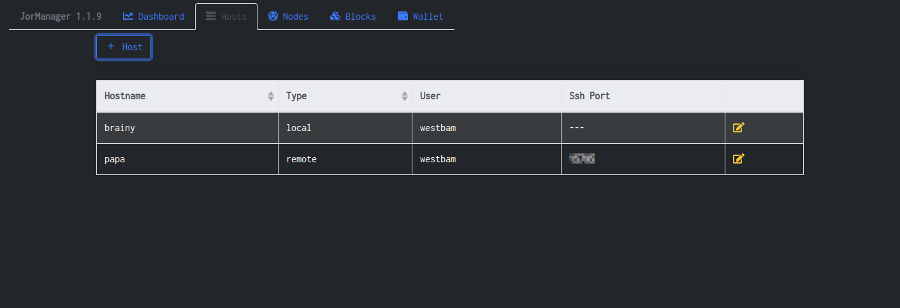
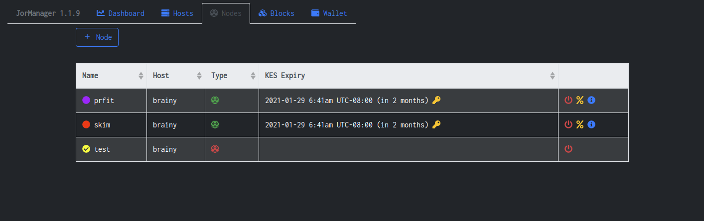
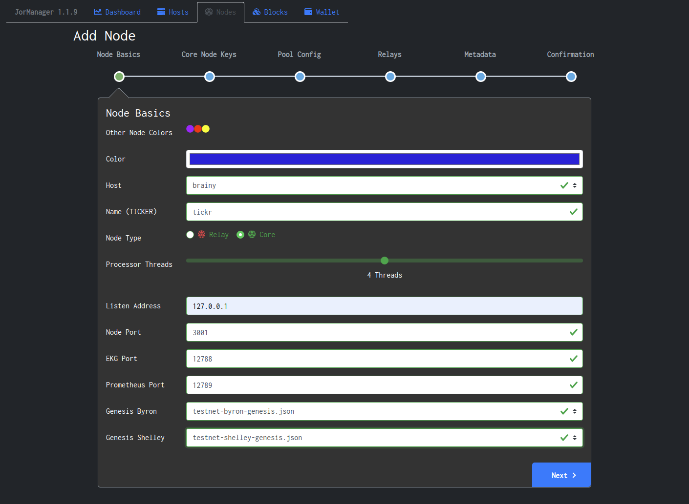
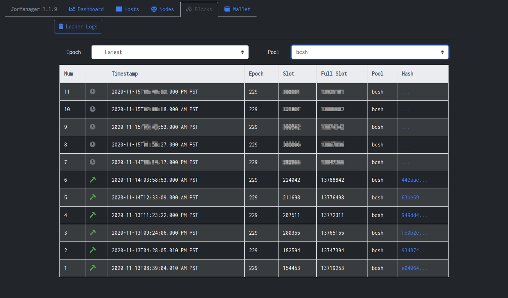
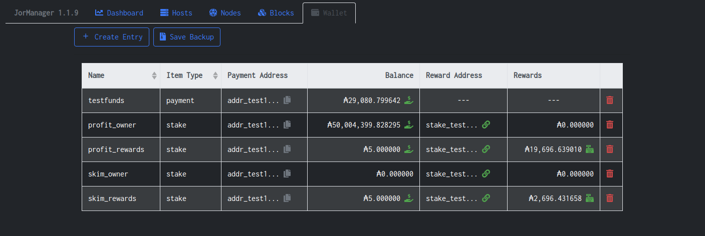
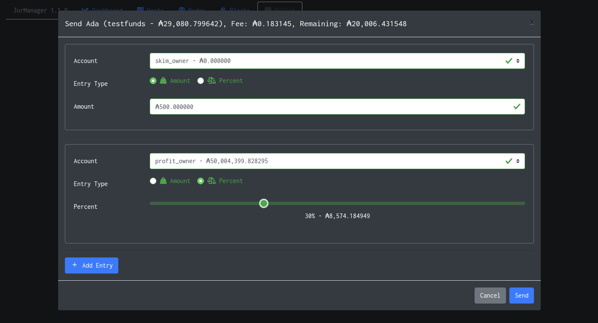
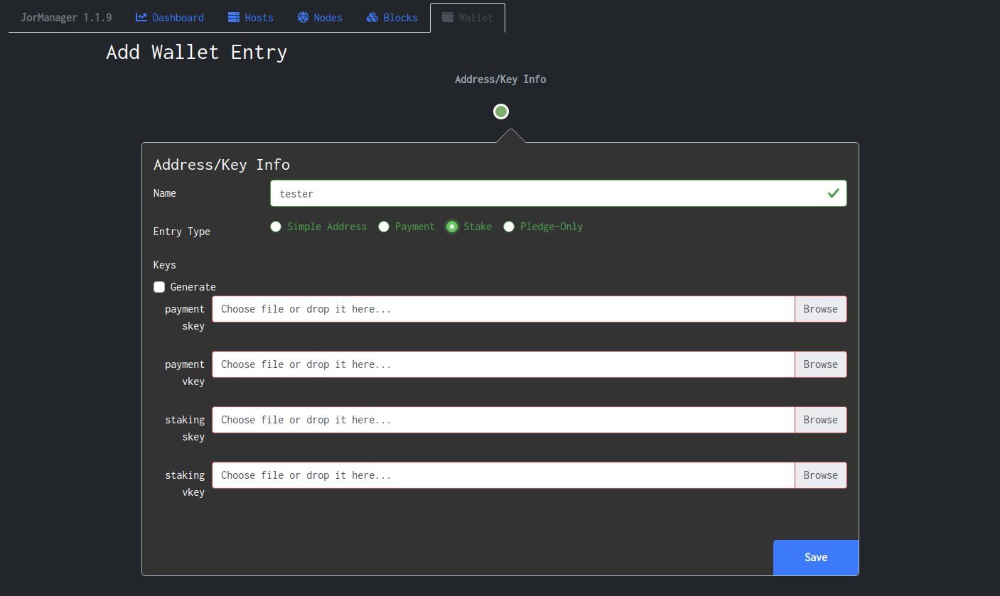

# JorManager

JorManager is a GUI-based Cardano stakepool management system. 

## What can it do?

### Monitor nodes and keys on a pretty dashboard

### Create connections to remote hosts

### Restart nodes, Rotate KES Keys, Modify pool fees, Edit pool metadata 

### Create nodes

### Monitor and Validate blocks. Calculate upcoming blocks (leader logs).

### Manage Stakepool funds, claim rewards, perform complex transactions.

## Get Started

Head over to our Wiki site for how to install and configure JorManager.

[JorManager Wiki Home](https://bitbucket.org/muamw10/jormanager/wiki/Home)

## Support

If you need support, the ask for help on this telegram channel -> https://t.me/jormanager

#### Project Support

This project is designed to do nothing more than help out the Cardano community and ecosystem. It's offered without charge and **without warranty** of any kind.