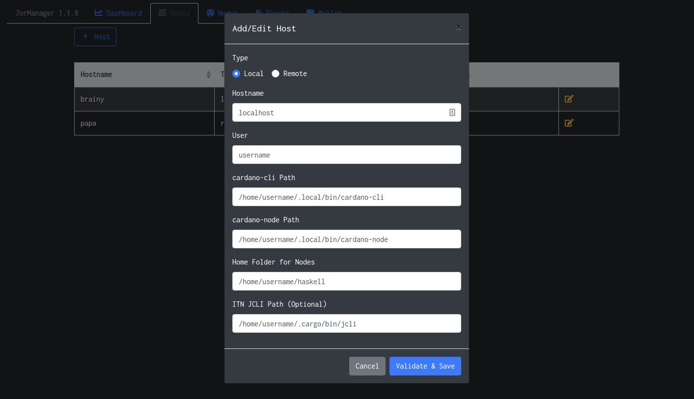
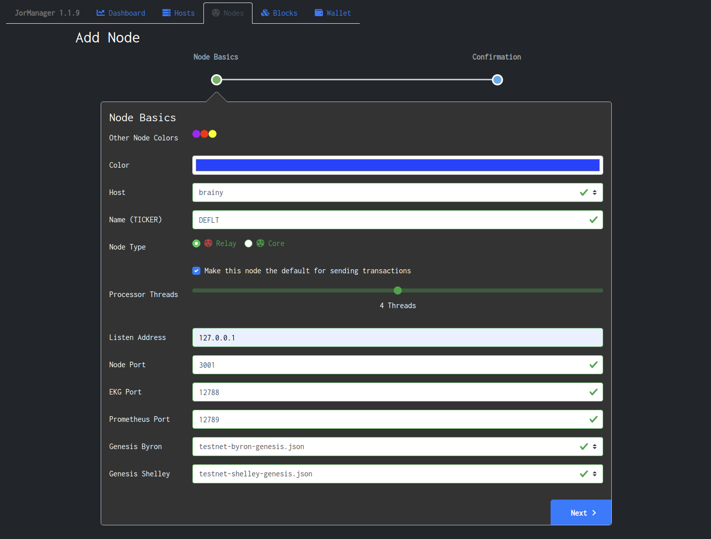

# Default Node Setup

The default node is used by JorManager for syncing blocks, keeping track of wallet balances, submitting transactions for moving funds, claiming rewards, submitting stakepool certificates, etc...

The default node should be a regular passive relay that isn't used for anything else. It should not allow any incoming connections through the firewall.

## Create a local host
To get started, first create a local host under the `Hosts` tab.

## Create a default node
Second, create a node on the local host under the `Nodes` tab. Set this node as the default node.

## Check the setup
Navigate to the `Dashboard` tab and ensure that blocks are being synced and the blockchain is moving up. Wait a long time until you're getting around 1 new block every 20 seconds. That will indicate that the node is fully synced.