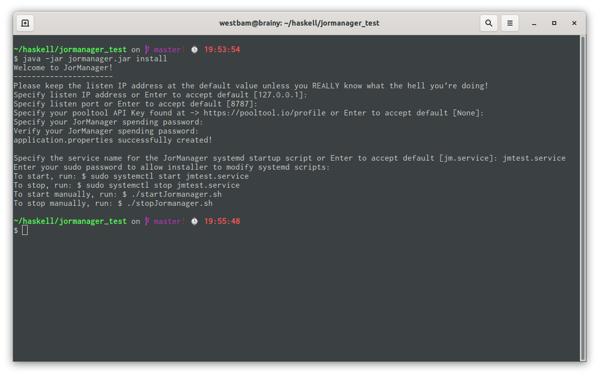

# Installation

JorManager is designed to be installed on Linux systems. Most of the commands in this guide will be designed for the Ubuntu distribution, but it should be able to run on others with slight modifications.

## Prepare environment

Update any packages on your system and configure some build environment tools.
```
#!bash

$ sudo apt-get update
...
...

$ sudo apt-get upgrade
...
...
$ sudo apt-get install python3 build-essential pkg-config libffi-dev libgmp-dev libssl-dev libtinfo-dev systemd libsystemd-dev zlib1g-dev make g++ tmux git jq libncursesw5 gnupg aptitude libtool autoconf secure-delete iproute2 bc tcptraceroute dialog libsqlite3-dev
```

## Requirements

### Java 21

JorManager requires Java 21 or higher.

```
#!bash

$ sudo apt-get install openjdk-21-jdk
...
...

$ java -version
openjdk 21.0.8 2025-07-15
OpenJDK Runtime Environment (build 21.0.8+9-Ubuntu-0ubuntu124.04.1)
OpenJDK 64-Bit Server VM (build 21.0.8+9-Ubuntu-0ubuntu124.04.1, mixed mode, sharing)
```
If you get an error stating java is not installed, make sure to perform the steps prior as they contain prerequisites.

If your `java -version` command doesn't show you java 21 as the default, you need run the following command and choose the correct java 21 version.

```
#!bash

$ sudo update-alternatives --config java
[sudo] password for westbam: 
There are 4 choices for the alternative java (providing /usr/bin/java).

  Selection    Path                                            Priority   Status
------------------------------------------------------------
* 0            /usr/lib/jvm/java-21-openjdk-amd64/bin/java      2111      auto mode
  1            /usr/lib/jvm/java-11-openjdk-amd64/bin/java      1111      manual mode
  2            /usr/lib/jvm/java-17-openjdk-amd64/bin/java      1711      manual mode
  3            /usr/lib/jvm/java-21-openjdk-amd64/bin/java      2111      manual mode
  4            /usr/lib/jvm/java-8-openjdk-amd64/jre/bin/java   1081      manual mode

Press <enter> to keep the current choice[*], or type selection number: 

```

### IOG libsodium

In order to do things like calculate leader logs, JorManager needs the version of libsodium from IOG.

```
#!bash

$ git clone https://github.com/input-output-hk/libsodium
...
...

$ cd libsodium
$ git checkout dbb48cce
HEAD is now at dbb48cce
$ ./autogen.sh
...
...

$ ./configure
...
...

$ make && make check
...
...

$ sudo make install
...
Libraries have been installed in:
   /usr/local/lib
...

```

## Install cardano-node and cardano-cli locally

In a normal JorManager setup, it's a good practice to have a local passive node on the same machine as JorManager. This node will be used for submitting transactions during the stakepool setup and keeping JorManager in sync with the blockchain. You can choose to have the default node be remote too, but local is the recommended setup for the default node.

You can follow any guide for installing these. I'm linking the one from IOG for reference.

[cardano-node installation](https://docs.cardano.org/getting-started/installing-the-cardano-node)


## Install cardano-node and cardano-cli on remotes

Follow the guide above for installing on any remote server nodes.

Configure remote SSH into the servers using passwordless SSH keys. While it's better security-wise to add a password to your keys, in an automated system like JorManager, this is too much friction to have JorManager prompt you for passwords each and every time it needs to talk to your remote nodes. Make sure you use best practices for securing the JorManager machine itself and any SSH Keys. ed25519 keys are recommended.

[https://medium.com/risan/upgrade-your-ssh-key-to-ed25519-c6e8d60d3c54](https://medium.com/risan/upgrade-your-ssh-key-to-ed25519-c6e8d60d3c54)


## Install JorManager

Now that we have our local JorManager host system configured and any remote nodes, we can setup JorManager itself.

### Install postgresql

```
$ sudo apt-get install postgresql postgresql-contrib pgadmin4-desktop
```

```
$ sudo -u postgres psql
postgres=# create database jormanager;
postgres=# create user jormanager with encrypted password 'jormanager';
postgres=# grant all privileges on database jormanager to jormanager;
postgres=# \q
```

If you use a different database name or password, make note of it and later put it into `application.properties` like:

```
# ---- Database Information ----
spring.datasource.url=jdbc:postgresql://localhost:5432/jormanager_myname
spring.datasource.username=my_username
spring.datasource.password=myPa$$w0rD
```


Next, download the latest JorManager jar file from bitbucket and put it into a location you control. I put everything in ~/haskell/jormanager or ~/haskell/jormanager_test if I'm configuring a testnet setup.

[JorManager Downloads](https://bitbucket.org/muamw10/jormanager/downloads/)

```
#!bash

$ cd ~/haskell/jormanager
$ wget https://bitbucket.org/muamw10/jormanager/downloads/jormanager-8.0.0-SNAPSHOT.jar.sha256
$ wget https://bitbucket.org/muamw10/jormanager/downloads/jormanager-8.0.0-SNAPSHOT.jar
$ sha256sum -c jormanager-8.0.0-SNAPSHOT.jar.sha256
jormanager-8.0.0-SNAPSHOT.jar: OK
$ rm jormanager-8.0.0-SNAPSHOT.jar.sha256
$ mv jormanager-*.jar jormanager.jar
$ java -jar jormanager.jar install
```


**SAVE YOUR SPENDING PASSWORD** in a secure location!!! If you lose this password, you lose any secret keys stored in JorManager. You're done, kaput, mount your picture on the stakepool operator wall of shame.

## Running

The installer has created several ways for you to run JorManager. If systemd was found on your system, the installer has created systemd scripts for you.
```
$ sudo systemctl start jm.service
$ sudo systemctl stop jm.service
```

If you don't have or use systemd, manual startup/shutdown scripts have been created for you.
```
$ ./startJormanager.sh
$ ./stopJormanager.sh
```

To access JorManager, open a browser to
```
http://localhost:<install_port>
```


If something gets screwed up, you might be instructed to dig into the database. It can be accessed using the PGAdmin app

Continue on to >> [Default Node Setup](defaultnode.md)